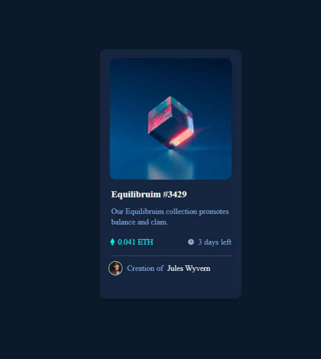

# Frontend Mentor - NFT preview card component solution

This is a solution to the [NFT preview card component challenge on Frontend Mentor](https://www.frontendmentor.io/challenges/nft-preview-card-component-SbdUL_w0U)

## Table of contents

- [Overview](#overview)
  - [The challenge](#the-challenge)
  - [Screenshot](#screenshot)
  - [Links](#links)
- [My process](#my-process)
  - [Built with](#built-with)
  - [What I learned](#what-i-learned)
  - [Continued development](#continued-development)
- [Author](#author)

## Overview

### The challenge

Users should be able to:

- View the optimal layout depending on their device's screen size
- See hover states for interactive elements

### Screenshot

### Links

- Solution URL: ()
- Live Site URL: ()

## My process

### Built with

- Semantic HTML5 markup
- SCSS
- CSS, Flexbox
- Mobile-first workflow

### What I learned

I improved my knowledge on how to get advantage of SASS

To see how you can add code snippets, see below:

### Continued development

Going to countine using SASS and trying alernative methods like styled component or css modules.

## Author

- Frontend Mentor - [@abdulrazzakalsssouki](https://www.frontendmentor.io/profile/Abdalrzakalsouki)
- LinkedIn - [@abdulrazzakalsssouki](https://www.linkedin.com/in/abdulrazzakalsssouki)
